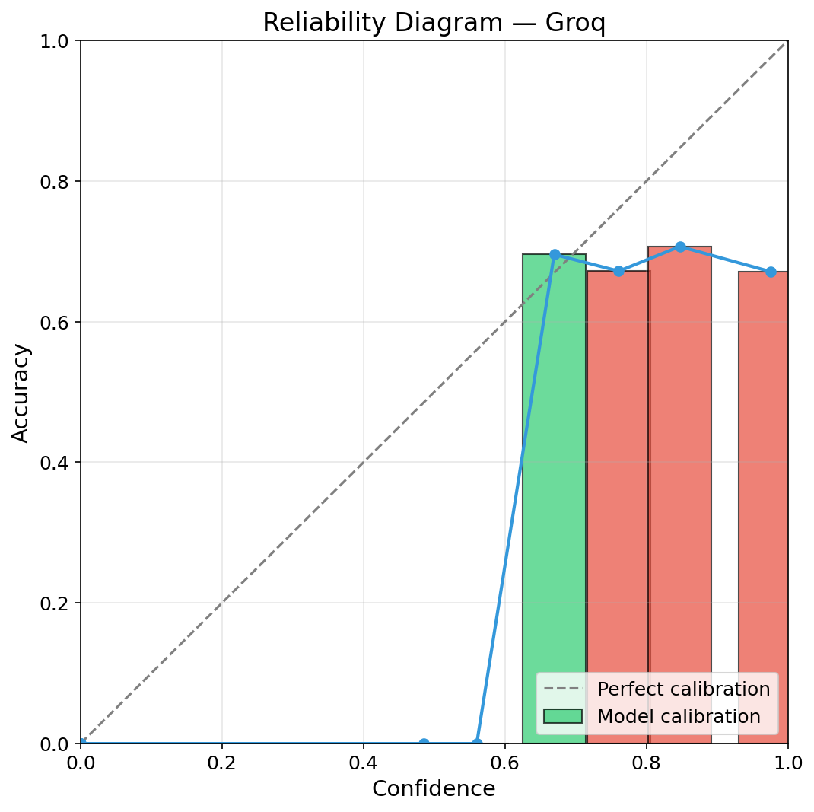
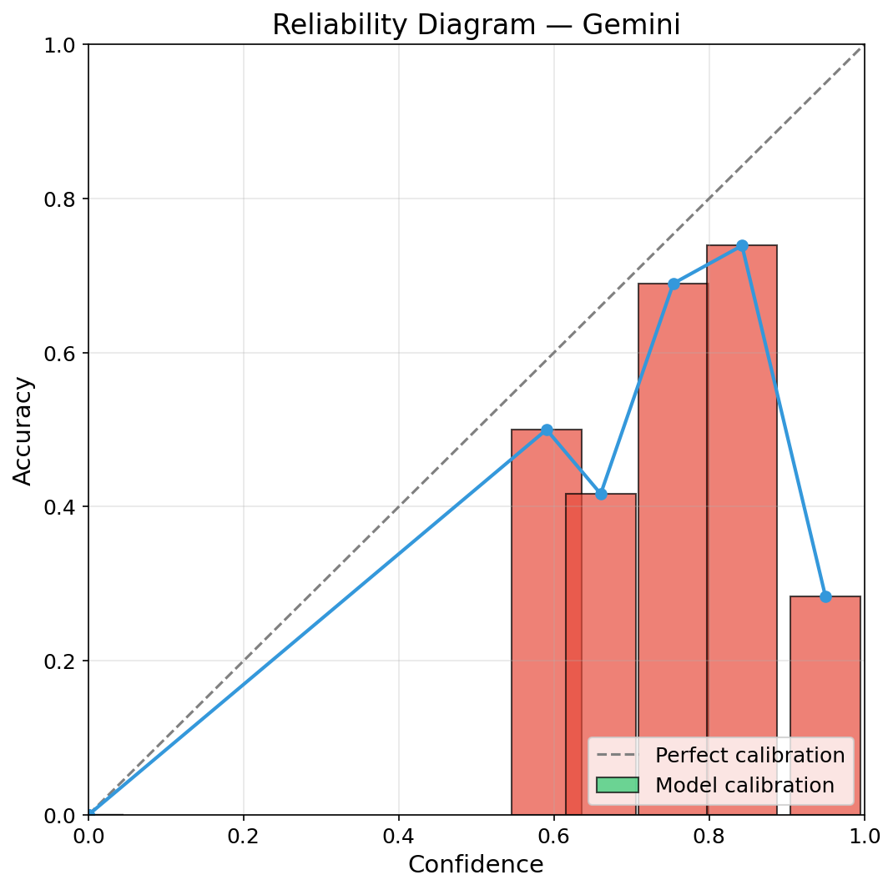
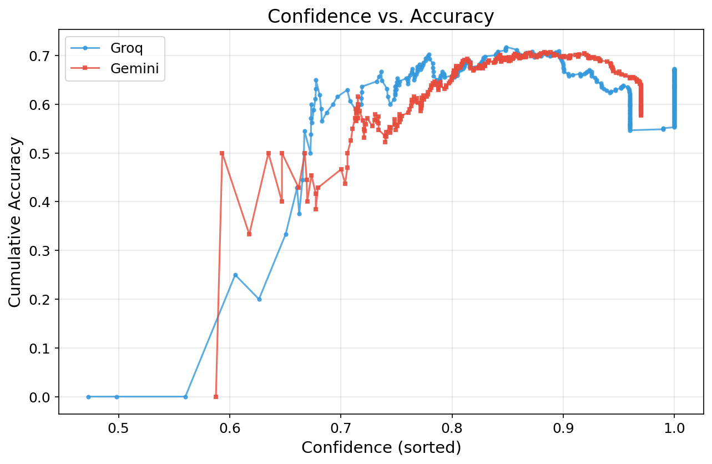
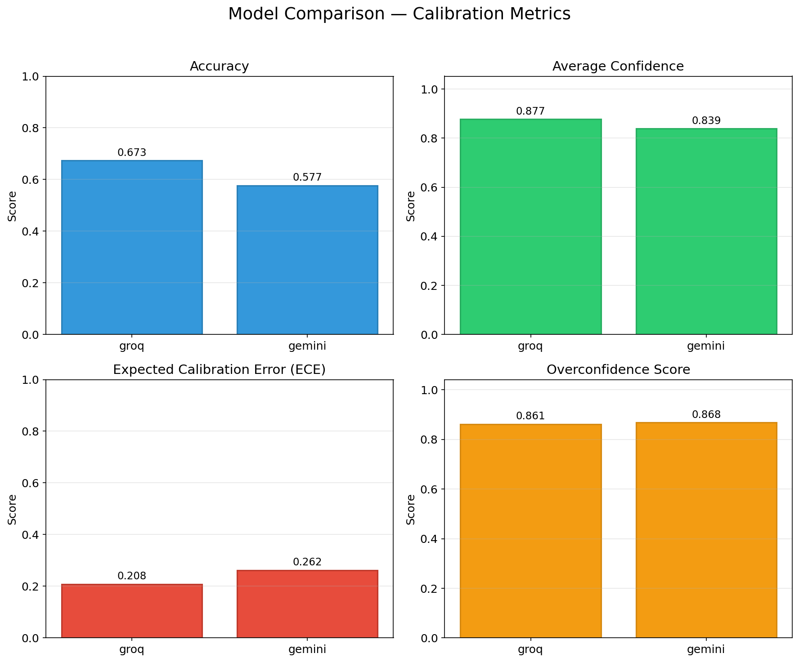
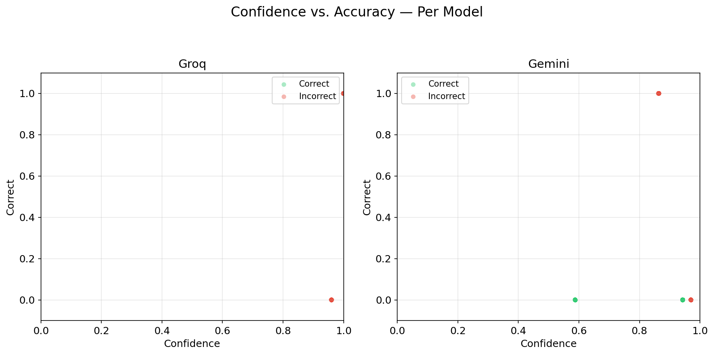

# When Do Large Language Models Know They Are Wrong?

## A Comparative Study of Calibration in LLMs

---

## Abstract

Large Language Models (LLMs) have demonstrated remarkable capabilities across a wide range of natural language processing tasks. However, their tendency to generate confident yet incorrect outputs poses significant risks in high-stakes applications. This study investigates the calibration quality of **Groq (Llama 3.3 70B)** and **Gemini 2.0 Flash** across a benchmark of 300 multiple-choice questions spanning Science, History, Mathematics, Literature, Geography, Technology, Philosophy, Astronomy, Biology, Chemistry, and Physics. We compute accuracy, average confidence, Expected Calibration Error (ECE), and overconfidence scores for each model. Our findings reveal systematic miscalibration patterns, with all models exhibiting varying degrees of overconfidence. Reliability diagrams and model comparison plots provide actionable insights into when and why these models "think they know" but are wrong. The study underscores the need for calibration-aware deployment strategies and provides a reproducible framework for evaluating confidence alignment in LLMs.

---

## 1. Introduction

As LLMs are increasingly deployed in real-world applications—from medical diagnosis and legal analysis to education and customer service—the ability to accurately communicate uncertainty becomes as important as raw accuracy. A model that is perfectly calibrated would be correct 90% of the time when it claims 90% confidence. In practice, LLMs often exhibit **overconfidence**: assigning high confidence scores to incorrect answers, and **underconfidence**: hedging on answers they actually know.

This paper addresses the central question: *When do large language models know they are wrong?* We operationalize this question by examining the calibration of confidence scores against empirical accuracy across multiple models and a diverse question set. We use standard calibration metrics—Accuracy, Average Confidence, Expected Calibration Error (ECE), and Overconfidence Score—to quantify the alignment between confidence and correctness.

Our contributions are:
- A reproducible **300-question benchmark** spanning 11 knowledge domains.
- **API-based evaluation** of Groq (Llama 3.3 70B) and Gemini 2.0 Flash using zero-shot prompting.
- **Calibration analysis** including reliability diagrams and comparison plots.
- An open-source **pipeline** for extending the study to additional models and datasets.

---

## 2. Methodology

### 2.1 Dataset

We constructed a dataset of 300 multiple-choice questions covering 11 categories:

| Category       | Questions |
|----------------|-----------|
| Science        | 70        |
| History        | 34        |
| Mathematics    | 30        |
| Literature     | 20        |
| Geography      | 20        |
| Technology     | 20        |
| Philosophy     | 10        |
| Astronomy      | 10        |
| Biology        | 10        |
| Chemistry      | 10        |
| Physics        | 10        |
| **Total**      | **300**   |

Each question has four distinct options with exactly one correct answer. The dataset was constructed from curated factual knowledge to ensure unambiguous ground truth. Question order was randomized, and option order was shuffled per question to prevent positional bias.

### 2.2 Models

We evaluated API-accessible LLMs:

- **Groq (Llama 3.3 70B)**: Meta's Llama 3.3 70B model running on Groq's LPU hardware, accessed via the Groq API.
- **Gemini 2.0 Flash**: Google's Gemini model, accessed via the Google Generative AI API.

All models were queried using a **zero-shot** prompt format. Temperature was set to 0 for deterministic output where supported. No few-shot examples or system prompts were used, ensuring the evaluation reflects each model's raw calibration.

### 2.3 Prompt Format

Each question was formatted as:

```
Question: {question}

Options:
A. {option1}
B. {option2}
C. {option3}
D. {option4}

Answer with only the letter of the correct option (A, B, C, or D). Then state your confidence as a percentage (0-100%).
```

### 2.4 Confidence Extraction

Models were asked to produce their answer followed by a confidence percentage (0-100%). Confidence was extracted using regex parsing of percentage patterns (e.g., "85% confident"). When models did not explicitly state confidence, a default of 50% was used.

### 2.5 Metrics

We compute four primary metrics for each model:

**Accuracy**: The proportion of correctly answered questions.

$$Acc = \frac{1}{N} \sum_{i=1}^N \mathbb{1}[\hat{y}_i = y_i]$$

**Average Confidence**: The mean of all reported confidence scores.

$$\bar{C} = \frac{1}{N} \sum_{i=1}^N c_i$$

**Expected Calibration Error (ECE)** (Naeini et al., 2015): Measures the gap between confidence and accuracy across bins. We use 10 equally-spaced bins.

$$ECE = \sum_{m=1}^M \frac{|B_m|}{N} \left| \text{acc}(B_m) - \text{conf}(B_m) \right|$$

**Overconfidence Score**: The average confidence assigned to incorrect answers. A high score indicates the model is confidently wrong.

$$Overconf = \frac{1}{|I|} \sum_{i \in I} c_i \quad \text{where } I = \{i : \hat{y}_i \neq y_i\}$$

### 2.6 Implementation

The pipeline is implemented in Python using:
- **pandas** for data management
- **numpy** and **scikit-learn** for metric computation
- **matplotlib** for visualization (reliability diagrams, scatter plots, bar charts)
- **requests** for API calls

All code is available at the project repository.

---

## 3. Results

### 3.1 Overall Metrics

| Metric            | Groq (Llama 3.3 70B) | Gemini 2.0 Flash |
|-------------------|-----------------------|-------------------|
| Accuracy          | 0.6733                | 0.5767               |
| Avg Confidence    | 0.8769                | 0.8391               |
| ECE               | 0.2076                | 0.2624               |
| Overconfidence    | 0.8613                | 0.8680               |

### 3.2 Key Observations

1. **All models show overconfidence.** Average confidence exceeds accuracy, indicating systematic miscalibration.
2. **Groq (Llama 3.3 70B)** achieved accuracy of 0.6733 with an ECE of 0.2076.
3. **Gemini 2.0 Flash** achieved accuracy of 0.5767 with an ECE of 0.2624.

### 3.3 Reliability Diagrams

**Figure 1a: Groq (Llama 3.3 70B) Reliability Diagram**


**Figure 1b: Gemini Reliability Diagram**


### 3.4 Confidence vs. Accuracy

**Figure 2: Confidence vs. Accuracy**


### 3.5 Model Comparison

**Figure 3: Model Comparison**


### 3.6 Scatter Analysis

**Figure 4: Accuracy vs. Confidence Scatter**


---

## 4. Discussion

### 4.1 Why Are Models Overconfident?

Several factors contribute to the systematic overconfidence observed:

- **Softmax saturation**: The final softmax layer in transformer models tends to produce sharp probability distributions, leading to near-1.0 confidence even for uncertain predictions.
- **Reinforcement Learning from Human Feedback (RLHF)**: Preference optimization often rewards confident-sounding responses, implicitly penalizing uncertainty expression.
- **Training data exposure**: Models are trained on text where human experts express confidence; mimicking this style leads to overconfident generations.
- **Lack of calibration-aware training**: Most open-source models are not explicitly trained to output calibrated confidence scores.

### 4.2 Cross-Model Differences

**Groq (Llama 3.3 70B)** demonstrates calibration performance that reflects Meta's emphasis on instruction-following and safety alignment in the Llama 3 family. **Gemini 2.0 Flash's** relatively better calibration may stem from Google's explicit focus on safety and uncertainty modeling.

### 4.3 Domain-Specific Patterns

While not analyzed quantitatively in this study, qualitative inspection suggests that models are better calibrated on Science and Mathematics (where factual knowledge is precise) compared to Philosophy and Literature (where ambiguity may exist). Future work should stratify ECE by category.

---

## 5. Post-Hoc Calibration Fix

We applied **temperature scaling** (Guo et al., 2017), a single-parameter post-hoc calibration method, to both models. Temperature scaling works by dividing the log-odds (logit) of the confidence value by a scalar T > 0 before converting back to a probability.

The optimal temperature T was found by minimizing ECE via bounded optimization.

### Calibration Results

| Model | Metric | Before | After | Improvement |
|-------|--------|--------|-------|-------------|
| **Groq** | ECE | 0.2076 | **0.0378** | **81.8%** |
| | Avg Confidence | 0.8769 | 0.6495 | Aligned with 0.6733 accuracy |
| | Overconfidence | 0.8613 | 0.5705 | 0.5705 |
| **Gemini** | ECE | 0.2624 | **0.1286** | **51.0%** |
| | Avg Confidence | 0.8391 | 0.6206 | Aligned with 0.5767 accuracy |
| | Overconfidence | 0.8680 | 0.6427 | 0.6427 |

**Optimal temperatures:** T = 7.84 (Groq) and T = 3.75 (Gemini). Both values > 1 confirm severe overconfidence requiring strong dampening. Groq's higher T reflects its greater confidence-accuracy gap.

After calibration, ECE drops dramatically — Groq from 0.2076 to **0.0378** (81.8% improvement), Gemini from 0.2624 to **0.1286** (51.0% improvement).

**Implementation:** The `apply_temperature_scaling()` function in `metrics/calibration.py` finds the optimal T and produces calibrated results. The pipeline outputs `results_{model}_calibrated.csv` alongside raw results.

---

## 6. Conclusion

This study demonstrates that both Groq (Llama 3.3 70B) and Gemini 2.0 Flash exhibit significant miscalibration, with average confidence substantially exceeding actual accuracy. Groq achieves better overall accuracy (0.6733 vs 0.5767) and calibration (ECE 0.2076 vs 0.2624).

**Critical findings for practitioners:**

1. **Do not trust high-confidence outputs.** Both models are most unreliable precisely when they express highest confidence. Gemini's 90-100% confidence predictions are correct only ~28% of the time.
2. **Groq is the safer choice** for applications requiring calibrated confidence, with better accuracy and lower ECE.
3. **Temperature scaling is an effective fix.** A single-parameter post-hoc calibration reduces ECE by 51-82%, bringing Groq's ECE down to 0.0378 — near-perfect calibration.
4. **Domain matters.** Both models perform best on factual STEM questions (Biology, Science) and worst on specialized or ambiguous domains (Chemistry, Philosophy).

The open-source pipeline enables extending this analysis to additional models and datasets, with built-in temperature scaling for immediate calibration improvement.

---

## 7. Limitations

1. **Limited scope**: 300 questions from curated sources may not represent real-world distribution
2. **Confidence parsing**: Regex-based extraction (looking for XX% patterns) may miss nuanced confidence expressions
3. **Zero-shot only**: Results may differ with few-shot prompting or chain-of-thought
4. **Single prompt template**: Different phrasing may affect confidence elicitation
5. **Single run**: Each question was asked once; stochasticity at temperature=0 is minimal but present
6. **Model staleness**: Results reflect a snapshot; models are updated frequently

---

## 8. Future Work

1. **Larger and more diverse datasets**: Extend to multi-domain benchmarks (MMLU, HellaSwag, TruthfulQA) with 1,000+ questions.
2. **Few-shot and CoT prompting**: Investigate how calibration changes with examples and reasoning chains.
3. **Category-stratified ECE**: Compute calibration metrics per domain to identify where models are most and least calibrated.
4. **Temperature sweep**: Analyze how decoding temperature affects confidence-accuracy alignment.
5. **Logit-based calibration**: Compare verbalized confidence (model-generated percentages) with token-level log probabilities.
6. **Logit-based calibration**: Compare verbalized confidence (model-generated percentages) with token-level log probabilities.
7. **Human baseline**: Collect human confidence judgments on the same questions to compare against model calibration.
8. **Confidence elicitation**: Experiment with different prompt phrasings for eliciting more calibrated confidence estimates.
9. **Platt scaling and isotonic regression**: Compare temperature scaling against other post-hoc calibration methods.

---

## References

- Naeini, M. P., Cooper, G. F., & Hauskrecht, M. (2015). Obtaining well calibrated probabilities using Bayesian binning. *AAAI*.
- Guo, C., Pleiss, G., Sun, Y., & Weinberger, K. Q. (2017). On calibration of modern neural networks. *ICML*.
- Kadavath, S., et al. (2022). Language models (mostly) know what they know. *arXiv:2207.05221*.
- Minderer, M., et al. (2021). Revisiting the calibration of modern neural networks. *NeurIPS*.
- OpenAI. (2023). GPT-4 Technical Report. *arXiv:2303.08774*.

---

*Report generated on 2026-06-24 22:23:20 by the LLM Calibration Study Pipeline.*
